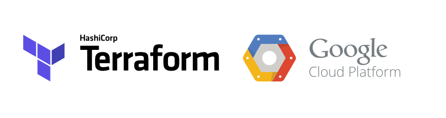
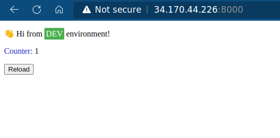

# Deploy python app on GCP using kubernetes
## Tools used in Project:
- GCP and Terraform


- Docker and Kubernetes

## Infastructure: 
- Service-account
- VPC
- 2 private-subnets (management, restricted)
- nat
- cloud-router
- firewall (Allow ssh and http)
- vm (bastion host)
- GCR
- GKE 

## Steps:
### 1) Apply the infrastructure using Terraform 
```bash
$ terraform apply --var-file prod.tfvars
```
### 2) SSH to the bastion host
```bash
gcloud compute ssh --zone "us-central1-a" "terraform-instance"  --tunnel-through-iap --project "gcp-project-356819"
```
### 3) Apply this commands to connect to the GKE cluster
```bash
$ curl -O https://dl.google.com/dl/cloudsdk/channels/rapid/downloads/google-cloud-cli-394.0.0-linux-x86_64.tar.gz
$ tar -xf google-cloud-cli-394.0.0-linux-x86_64.tar.gz
$ ./google-cloud-sdk/install.sh
$ ./google-cloud-sdk/bin/gcloud init

# install gcloud packages and update repo
$ sudo apt-get install apt-transport-https ca-certificates gnupg
$ echo "deb [signed-by=/usr/share/keyrings/cloud.google.gpg] https://packages.cloud.google.com/apt cloud-sdk main" | sudo tee -a /etc/apt/sources.list.d/google-cloud-sdk.list
$ curl https://packages.cloud.google.com/apt/doc/apt-key.gpg | sudo apt-key --keyring /usr/share/keyrings/cloud.google.gpg add -
$ sudo apt-get update

$ sudo apt-get install google-cloud-sdk-gke-gcloud-auth-plugin

$ sudo apt-get install kubectl

# connect to the cluster
$ gcloud container clusters get-credentials my-gke-cluster --region us-central1 --project gcp-project-356819

# check cluster connection 
$ kubectl get nodes
```
### 4) Deploy app on kubernetes cluster
```bash
amir@terraform-instance:~/python-redis-app$ kubectl get all
W0728 23:12:29.781115   13210 gcp.go:120] WARNING: the gcp auth plugin is deprecated in v1.22+, unavailable in v1.25+; use gcloud instead.
To learn more, consult https://cloud.google.com/blog/products/containers-kubernetes/kubectl-auth-changes-in-gke
NAME                                 READY   STATUS    RESTARTS   AGE
pod/frontend-deploy-789666bd-7zjqd   1/1     Running   0          105m

NAME                    TYPE           CLUSTER-IP     EXTERNAL-IP     PORT(S)          AGE
service/kubernetes      ClusterIP      10.52.0.1      <none>          443/TCP          12h
service/lb-service      LoadBalancer   10.52.1.132    34.170.44.226   8000:30010/TCP   146m

NAME                              READY   UP-TO-DATE   AVAILABLE   AGE
deployment.apps/backend-deploy    1/1     1            1           145m
deployment.apps/frontend-deploy   1/1     1            1           105m

NAME                                       DESIRED   CURRENT   READY   AGE
replicaset.apps/backend-deploy-d9ff645d5   1         1         1       145m
replicaset.apps/frontend-deploy-789666bd   1         1         1       105m
```
### 5) ensure that the app is running

